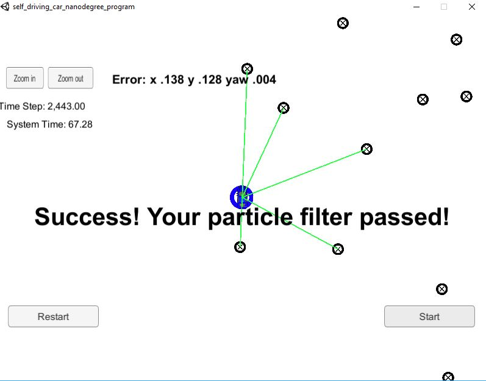

# CarND-Kidnapped-Vehicle-Project
Udacity Self-Driving Car Nanodegree - Kidnapped Vehicle project

## Overview
This project implements a Particle Filter applied to a Kidnapped robot(car) problem. A simulator is provided by Udacity (it could be downloaded here). This simulator will generate noisy landmark observation from a car to the Particle Filter. At each time step the filter will get observation and control data. Udacity provides a seed project to start from on this project ([here](https://github.com/udacity/CarND-Kidnapped-Vehicle-Project)).

## Prerequisites

The project has the following dependencies (from Udacity's seed project):

- cmake >= 3.5
- make >= 4.1
- gcc/g++ >= 5.4
- Udacity's simulator.

For instructions on how to install these components on different operating systems, please, visit [Udacity's seed project](https://github.com/udacity/CarND-Kidnapped-Vehicle-Project). As this particular implementation was done on Mac OS, the rest of this documentation will be focused on Mac OS. I am sorry to be that restrictive.

In order to install the necessary libraries, use the [install-mac.sh](./install-mac.sh).


## Compiling and executing the project

In this project, Udacity's seed repo provides scripts to clean, compile and run it. These are the following commands you need to run from this repo directory

```
> ./clean.sh
> ./build.sh
> ./run.sh
```

You will see a message indicating the filter is listening:

```
> ./run.sh
Listening to port 4567

```
## Inputs to the Particle Filter
You can find the inputs to the particle filter in the `data` directory. 

#### The Map*
`map_data.txt` includes the position of landmarks (in meters) on an arbitrary Cartesian coordinate system. Each row has three columns
1. x position
2. y position
3. landmark id

> * Map data provided by 3D Mapping Solutions GmbH.


#### Control Data
`control_data.txt` contains rows of control data. Each row corresponds to the control data for the corresponding time step. The two columns represent
1. vehicle speed (in meters per second)
2. vehicle yaw rate (in radians per second)

#### Observation Data
The `observation` directory includes around 2000 files. Each file is numbered according to the timestep in which that observation takes place. 

## Result

